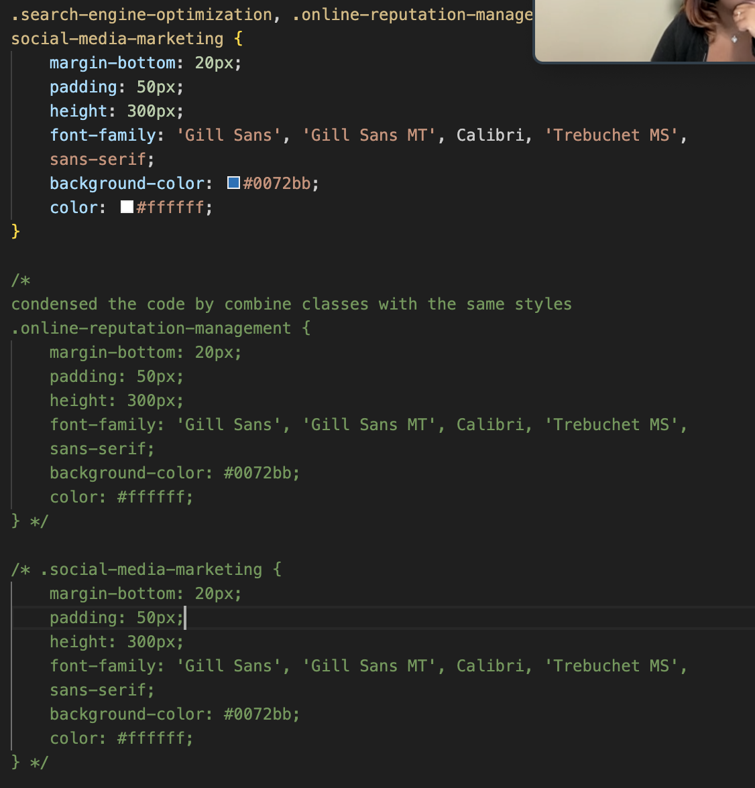

# 01 HTML, CSS, and Git: Code Refactor

## Danielle Sternthal Challenge One Homework

### CSS Changes

Consolidated Classes that has the same style.  Please see below for reference:

 

### HTML Changes

Renamed nonSemantic elements to semantic elements to indicate task

### URLS
Live Application link: https://dsternthal.github.io/Horiseon-Refactor/

Github Link: https://github.com/dsternthal/Horiseon-Refactor